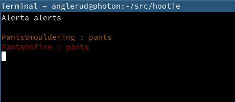
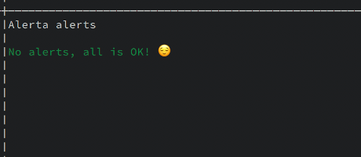

# Hootie

Terminal view of Alerta alerts.

[](https://travis-ci.org/anglerud/hootie)


If there are alerts:



If there's none:




## Installation

You can download it from the releases, here on github, or you can install it
with cargo:

```bash
$ cargo install hootie
```


## Building

```bash
$ cargo build
```

or:

```
$ cargo build --release
```


## Usage

Hootie only takes one parameter - the url to get alerts from your Alerta
instance. Here is an example from a deployment I use, which has selected open
alerts on the 'infrastructure' service:

```bash
$ hootie --alerta-url='http://alerta.res.ahl/api/alerts?status=open&service=infrastructure'
```


## Fake Alerta

There is a small python script in the `fake_alerta` dir that can pretend to be
alerta while you're working on Hootie. It's very simple.

If you use it, then you can invoke Hootie like this:

```bash
$ hootie --alerta-url='http://localhost:8080'
```
